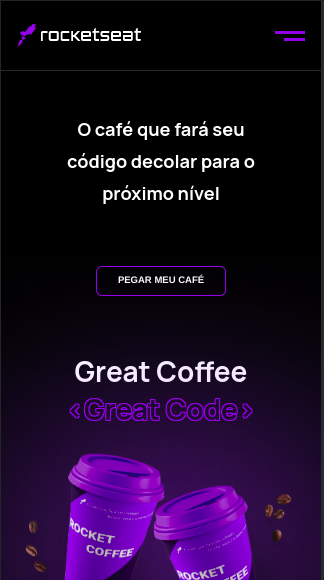
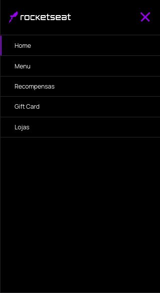
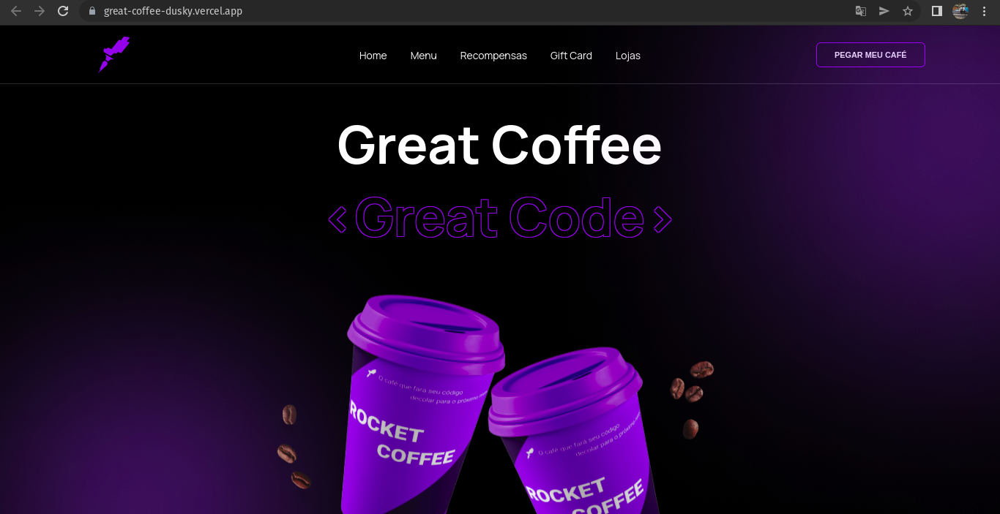

<h1 align="center">
    
</h1>

<h1 align="center">
    
     
     
</h1>

## 🏷️ Sobre 
**GreatCoffee** é uma aplicação feita com um único objetivo, aprimorar minhas habilidades com HTML, CSS(utilizando um pré-processador, SASS), e trabalhar isso com um sistema de componetização no React.

O layout utilizado para fazer a aplicação foi providenciado pela Rocketseat, e faz parte de um dos vários desafios de construção de layout que um dos seus cursos abordam.

---

## 💻 Acessar a aplicação
- [GreatCoffee](https://great-coffee-dusky.vercel.app/)

---

## 🛠️ Tecnologias utilizadas
Foram utilizadas as seguintes tecnologias para desenvolver a aplicação **GreatCoffee** :

- [React](https://pt-br.reactjs.org/)
- [Sass](https://sass-lang.com/)
- [HTML5](https://pt.wikipedia.org/wiki/HTML5)

---

## 🗂️ Como baixar e iniciar o projeto 

```bash

    #clonar o projeto
    $ git clone https://github.com/ElisioWander/greatCoffee.git

    #entrar no diretório
    $ cd greatCoffee

    #instalar as dependências
    $ yarn

    #iniciar a aplicação
    $ yarn start
```
### Servidor local
localhost:3000

---

## Autor
### 👤 Elisio Wander

- Linkedin: [@elisioWander](https://www.linkedin.com/in/elisio-wander-b88b69136/)
- github: [@elisioWander](https://github.com/ElisioWander)

---
## 📝 Licença
Copyright © 2020 [@ElisioWander](https://github.com/ElisioWander/greatCoffee/blob/main/LICENSE)

Este projeto está sobe a [LICENÇA MIT](https://opensource.org/licenses/MIT)

---

### Desenvolvido 💜 by Elisio Wander
